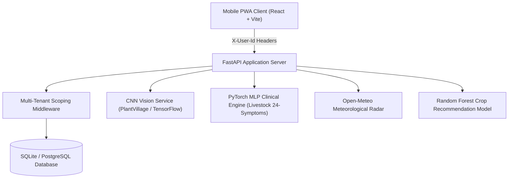

# 🌾 AgriTech AI — Comprehensive System Documentation & Technical Blueprint

> **Smart Agricultural & Livestock Management Command Platform with Deep Learning Diagnostics, Multi-Tenant Data Isolation, and Hyperlocal Agro-Meteorological Intelligence.**

---

## 📌 Table of Contents

1. [Executive Summary & System Architecture](#1-executive-summary--system-architecture)
2. [Technology Stack](#2-technology-stack)
3. [Multi-Tenant Data Isolation & Production Test Environments](#3-multi-tenant-data-isolation--production-test-environments)
4. [Core Modules & Application Workflows](#4-core-modules--application-workflows)
   - [4.1 Farmer Authentication & Onboarding](#41-farmer-authentication--onboarding)
   - [4.2 Farm Command Dashboard (Home)](#42-farm-command-dashboard-home)
   - [4.3 Crop & Field Lifecycle Management](#43-crop--field-lifecycle-management)
   - [4.4 Days-After-Sowing (DAS) Activity Calendar](#44-days-after-sowing-das-activity-calendar)
   - [4.5 AI Vision Plant Disease Scanner](#45-ai-vision-plant-disease-scanner)
   - [4.6 Livestock & Digital Herd Registry](#46-livestock--digital-herd-registry)
   - [4.7 Clinical Veterinary MLP Health Diagnostic System](#47-clinical-veterinary-mlp-health-diagnostic-system)
   - [4.8 Live Agro-Meteorological Weather Station](#48-live-agro-meteorological-weather-station)
   - [4.9 Farm Financials, Expenses & Analytics](#49-farm-financials-expenses--analytics)
   - [4.10 History Timeline & Notification Engine](#410-history-timeline--notification-engine)
5. [Deep Learning & Machine Learning Models](#5-deep-learning--machine-learning-models)
6. [Backend API Reference](#6-backend-api-reference)
7. [Database Schema & Entity Relationship Model](#7-database-schema--entity-relationship-model)
8. [Frontend Design System & UX Standards](#8-frontend-design-system--ux-standards)
9. [Installation, Configuration & Execution](#9-installation-configuration--execution)

---

## 1. Executive Summary & System Architecture

AgriTech AI is an end-to-end, mobile-first agricultural and livestock operating system engineered to empower modern agribusinesses, commercial farms, and smallholders. The platform fuses **Computer Vision (CNNs)**, **Tabular Neural Networks (MLP)**, and **real-time meteorological telemetry (Open-Meteo)** to optimize crop yields, monitor animal health, and automate farm operations.

### High-Level Architectural Flow



---

## 2. Technology Stack

### Frontend
- **Framework**: React 18+ with Vite 8.2 fast build engine
- **Routing**: React Router v6
- **Styling**: Modern Vanilla CSS, Glassmorphism, CSS Custom Properties Design Tokens
- **Icons & Typography**: Standardized Unicode Agro-Glyphs, System Inter Typography
- **Client Storage**: `localStorage` (Scoped multi-tenant state cache v4)

### Backend
- **Framework**: FastAPI (High-performance asynchronous Python 3.11+)
- **ORM & Database**: SQLAlchemy 2.0 with SQLite (production-ready for PostgreSQL migration)
- **Validation**: Pydantic v2 schemas
- **Server**: Uvicorn ASGI

### Machine Learning & AI
- **Computer Vision**: TensorFlow / Keras CNN for plant leaf disease classification (38+ pathology classes)
- **Tabular Neural Networks**: PyTorch Multi-Layer Perceptron (MLP) for livestock diagnostics (24 clinical symptoms, 5-6 differential disease classes)
- **Crop Recommender**: Scikit-Learn Random Forest Classifier (NPK, pH, Rainfall, Temperature features)
- **Meteorology**: Live Open-Meteo REST integration

---

## 3. Multi-Tenant Data Isolation & Production Test Environments

The platform enforces **strict data isolation** at both the API header layer (`X-User-Id`) and database ORM layer. Every field, animal, expense, activity, and notification belongs exclusively to the authenticated farm partition.

### 4 Production Test Environments

| # | Farmer Name | Location | Farm Type | Acreage | Fields | Livestock | Annual Revenue |
|---|---|---|---|---|---|---|---|
| 🌾 **1** | **Arun Singh Dhaliwal** (`arun.dhaliwal@agritech.in` / `1234`) | Ludhiana, Punjab | Large Commercial Farm | 52.0 Ac | **18 Plots** | **32 Animals** | ₹4,800,000 |
| 🌿 **2** | **Priya Venkataraman** (`priya.v@agritech.in` / `1234`) | Mysuru, Karnataka | Medium Mixed Farm | 23.5 Ac | **12 Plots** | **24 Animals** | ₹2,100,000 |
| 🐄 **3** | **Ibrahim Ali Sheikh** (`ibrahim.sheikh@agritech.in` / `1234`) | Guwahati, Assam | Livestock-Focused Farm | 12.5 Ac | **5 Plots** | **45 Animals** | ₹1,800,000 |
| 🌱 **4** | **Kavita Patel** (`kavita.patel@agritech.in` / `1234`) | Indore, Madhya Pradesh | Crop-Diverse Farm | 48.0 Ac | **20 Plots** | **18 Animals** | ₹2,600,000 |

---

## 4. Core Modules & Application Workflows

### 4.1 Farmer Authentication & Onboarding
- **3-Mode Login System**:
  1. **⚡ 4 Farm Profiles**: One-click instant switching between the 4 regional master production accounts.
  2. **🔑 Email / Password**: Direct credential verification (`1234` default PIN).
  3. **📱 Mobile OTP**: Frictionless 4-digit SMS verification.
- **Dynamic User Provisioning**: Typing a custom name/email auto-provisions an isolated farm database partition.
- **Product Tour & Guided Setup**: 4-step wizard for registering farmer bio, land geography, crop selection, and herd census.

---

### 4.2 Farm Command Dashboard (Home)
- **KPI Summary Metrics**: Total acreage, active crop plot count, herd population count, and gross revenue summary.
- **Quick Action Bar**: Direct shortcuts to AI Scan, Add Field, Health Check, and Weather Advisory.
- **Dynamic Field & Herd Highlights**: Real-time health status badges, active growth stages, and urgent vaccination alerts.
- **Farm Weather Card**: Live temperature, meteorological conditions, and humidity for the user's specific location.

---

### 4.3 Crop & Field Lifecycle Management
- **Plot Directory**: Visual cards showing field name, soil type, acreage, current crop, sowing date, and health status.
- **Crop Stage Engine**: Automatic growth stage determination across 8 standard agricultural phases (Germination, CRI, Tillering, Vegetative, Flowering, Grain Filling, Maturity, Harvesting).
- **Nutrient & Water Guidance**: Stage-specific NPK fertilizer dosage (kg/acre) and irrigation requirements.

---

### 4.4 Days-After-Sowing (DAS) Activity Calendar
- **True Sowing Date Anchoring**: Continuous timeline calculation across months from the actual sowing date (e.g. August sowing calculates Day 61 on 1 Oct and Day 91 on 31 Oct).
- **Interactive Calendar Grid**: Daily view indicating scheduled agronomic tasks, foliar spray windows, and fertilizer top-dressing.
- **Custom Field Filtering**: Seamless dropdown to switch between all user-owned plots.

---

### 4.5 AI Vision Plant Disease Scanner
- **Dual Capture Modes**: Real-time camera feed or direct image file upload.
- **Real-Time Classification**: Identifies 38+ plant-disease pairs with confidence percentages.
- **Comprehensive Diagnostic Output**:
  - Disease nomenclature & scientific classification
  - Severity level assessment (Low / Moderate / Severe)
  - Organic biological controls & chemical fungicide/pesticide dosage
  - Preventive cultural practices

---

### 4.6 Livestock & Digital Herd Registry
- **Comprehensive Species Support**: Cows (`🐄`), Buffalos (`🐃`), Sheep (`🐑`), Goats (`🐐`), Pigs (`🐷`), Ducks (`🦆`), Poultry (`🐔`), and Oxen (`🐂`).
- **Individual Animal Profiles**: Ear tag ID, breed, age, weight, lactation / egg yields, and health status.
- **Vaccination Tracker**: Tracks scheduled, due, and completed vaccines (FMD, HS, BQ, Brucellosis, Anthrax) with **"Mark as Executed / Done"** one-click updates.

---

### 4.7 Clinical Veterinary MLP Health Diagnostic System
- **24 Systematic Symptoms** across 5 clinical categories:
  1. *Mouth & Hoof Lesions*: Blisters on mouth, tongue, gums, hooves; sores on mouth, tongue, gums, hooves.
  2. *Locomotion & Mobility*: Difficulty walking, lameness, limb swelling, extremity swelling.
  3. *Systemic & General*: Loss of appetite, fatigue, depression, sweats, chills, painless lumps.
  4. *Respiratory*: Shortness of breath, chest discomfort, crackling sounds.
  5. *Inflammation*: Abdominal swelling, muscle swelling, neck swelling.
- **Diagnostic Engine**: Computes softmax probability distribution across disease classes (Foot and Mouth Disease, Anthrax, Blackleg, Lumpy Skin Disease, Pneumonia, Mastitis).
- **Full Result Screen**: Circular confidence ring, confirmed symptom checklist, neural probability breakdown, and step-by-step veterinary action plan.

---

### 4.8 Live Agro-Meteorological Weather Station
- **Hyperlocal Weather Station**: Real-time temperature, condition icon, humidity, wind velocity, rain probability, and UV index powered by Open-Meteo.
- **5-Day Visual Outlook**: Daily temperature range bars and precipitation probabilities.
- **Farm Operation Directives**: Dynamic safety indicators for Spraying Windows (wind speed check) and Irrigation Windows (rain probability check).
- **Active Field Impact Directives**: Generates custom weather advisories for every plot belonging to the active farmer.

---

### 4.9 Farm Financials, Expenses & Analytics
- **Category Expense Tracking**: Seeds, Fertilizers, Pesticides, Labour, Irrigation, Veterinary, Machinery, Infrastructure, Feed.
- **Financial Analytics**: Total operational expenditures vs. estimated crop & dairy revenues.
- **Expense Entry Logging**: Modal to record new farm transactions with date, category, amount, and description.

---

### 4.10 History Timeline & Notification Engine
- **Chronological Farm Ledger**: Filterable history entries for Crop operations, Livestock milestones, Disease scans, and Vaccinations.
- **Priority-Ranked Notifications**: Urgent alerts (clinical issues, overdue vaccines), Action items (spraying advisories), and Information updates (yield logs).

---

## 5. Deep Learning & Machine Learning Models

### 1. Plant Disease CNN Classifier
- **Architecture**: Deep Convolutional Neural Network (Transfer learning via MobileNetV2 / ResNet50 backbone)
- **Input**: 224×224×3 RGB Leaf Images
- **Output**: 38 Classes (e.g., Apple Scab, Tomato Early Blight, Corn Common Rust, Healthy)

### 2. Livestock Disease Multi-Layer Perceptron (MLP)
- **Architecture**: 3-layer Dense Neural Network with Dropout and BatchNorm
- **Input Feature Vector**: 26 dimensions (Animal Type encoded + Age + Temperature + 24 binary symptom flags)
- **Output**: Multi-class Softmax Probability Distribution (FMD, Anthrax, Blackleg, etc.)

### 3. Crop Recommendation Engine
- **Model**: Random Forest Classifier
- **Inputs**: Soil Nitrogen (N), Phosphorus (P), Potassium (K), pH level, Rainfall (mm), Temperature (°C), Humidity (%)
- **Output**: Optimal crop recommendation ranked by suitability score

---

## 6. Backend API Reference

| Method | Endpoint | Description | Scoping |
|---|---|---|---|
| `GET` | `/api/farm/profile` | Returns farmer bio & farm land details | `X-User-Id` |
| `PUT` | `/api/farm/profile` | Updates farm soil, acreage, and location | `X-User-Id` |
| `GET` | `/api/farm/fields` | Lists all fields for authenticated farm | `X-User-Id` |
| `POST` | `/api/farm/fields` | Adds a new crop plot | `X-User-Id` |
| `GET` | `/api/livestock` | Returns all herd animals & species counts | `X-User-Id` |
| `POST` | `/api/livestock` | Registers animal + auto-schedules vaccines | `X-User-Id` |
| `GET` | `/api/livestock/{id}` | Returns animal profile, vaccines & past health tests | `X-User-Id` |
| `POST` | `/api/livestock/assess` | Runs 24-symptom MLP health diagnostic | `X-User-Id` |
| `GET` | `/api/livestock/vaccinations/all` | Lists all vaccination schedules across herd | `X-User-Id` |
| `PUT` | `/api/livestock/vaccinations/{id}/done` | Marks vaccination as executed | `X-User-Id` |
| `POST` | `/api/crops/disease/predict` | Vision CNN inference on uploaded leaf image | Global / Field |
| `POST` | `/api/crops/recommend` | Recommends crops from soil & climate features | Global / Farm |
| `GET` | `/api/weather/advisory` | Returns live weather & field impact directives | `X-User-Id` |
| `GET` | `/api/expenses` | Returns all farm financial expense records | `X-User-Id` |
| `POST` | `/api/expenses` | Logs a new expense item | `X-User-Id` |
| `GET` | `/api/notifications` | Returns active notifications for farm | `X-User-Id` |
| `GET` | `/api/history` | Returns chronological farm activity audit trail | `X-User-Id` |

---

## 7. Database Schema & Entity Relationship Model

```
 ┌───────────────┐       1:1       ┌───────────────┐
 │    Farmer     │─────────────────│     Farm      │
 └───────────────┘                 └───────────────┘
                                           │
         ┌───────────────────┬─────────────┴─────────────┬──────────────────┐
         │ 1:N               │ 1:N                       │ 1:N              │ 1:N
 ┌───────────────┐   ┌───────────────┐           ┌───────────────┐  ┌───────────────┐
 │     Field     │   │    Animal     │           │    Expense    │  │ Notification  │
 └───────────────┘   └───────────────┘           └───────────────┘  └───────────────┘
         │ 1:N               │ 1:N
 ┌───────────────┐   ┌───────────────┐
 │ CropActivity  │   │  Vaccination  │
 └───────────────┘   └───────────────┘
                             │ 1:N
                     ┌───────────────────┐
                     │ HealthAssessment  │
                     └───────────────────┘
```

---

## 8. Frontend Design System & UX Standards

- **Primary Colors**: Signature Emerald (`#064e3b`), Forest Jade (`#047857`), Vibrant Green (`#059669`)
- **Atmospheric Blue (Weather)**: Deep Sky (`#075985` $\rightarrow$ `#0284c7` $\rightarrow$ `#0ea5e9`)
- **Veterinary Slate (Livestock)**: Charcoal Navy (`#0f172a` $\rightarrow$ `#1e293b` $\rightarrow$ `#334155`)
- **Card Styling**: `border-radius: 18px–22px`, subtle border `1px solid rgba(0,0,0,0.06)`, frosted glass backdrops
- **Typography Standards**:
  - Screen Titles: `20.5px`, `font-weight: 700`, `letter-spacing: -0.3px`
  - Section Headers: `11px`, `font-weight: 700`, uppercase, letter-spacing `0.5px`
  - Body Text: `13px–14px`, `color: var(--char-700)`

---

## 9. Installation, Configuration & Execution

### Prerequisites
- Python 3.10+
- Node.js 18+ & npm

### Backend Setup
```bash
# Navigate to backend directory
cd backend

# Install dependencies
pip install -r requirements.txt

# Run FastAPI ASGI server
python -m uvicorn backend.main:app --reload --port 8000
```

### Frontend Setup
```bash
# Navigate to frontend directory
cd frontend

# Install dependencies
npm install

# Start Vite development server
npm run dev

# Build production bundle
npm run build
```

---
*AgriTech AI System Documentation · Authored for National SIH Hackathon & Production Deployment.*
